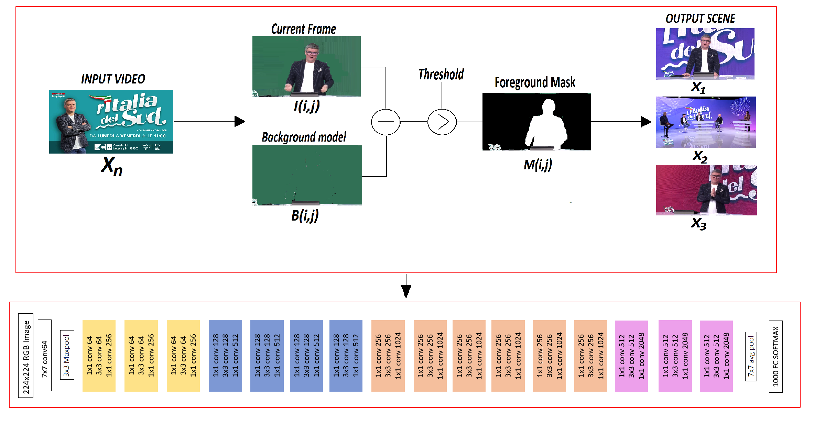

# Shot Boundary Detection and CNN for Video Classification



This project implements a robust video classification pipeline that combines **Shot Boundary Detection (SBD)** with a **Convolutional Neural Network (CNN)** based on ResNet50 for classifying video frames into predefined categories. The work is inspired by and expands on the research presented in:

> Candela, Federico, et al. "Shot boundary detection and convolutional neural network for video classification." 2023 3rd International Conference on Electrical, Computer, Communications and Mechatronics Engineering (ICECCME). IEEE, 2023.

## Key Features

1. **Shot Boundary Detection**: The system analyzes motion across frames to detect scene transitions and identify stable frames for classification.
2. **ResNet50-Based Classification**: Utilizes a pre-trained ResNet50 model fine-tuned for video frame classification.
3. **Data Augmentation**: Implements advanced augmentation techniques to improve generalization.
4. **Evaluation Metrics**: Produces detailed classification reports and confusion matrices for model performance evaluation.
5. **Visualization**: Plots training loss and accuracy over epochs to analyze model performance.

## How It Works

### 1. Preprocessing
- Images are loaded from the dataset directory, resized to \(224 \times 224\), and converted to RGB.
- Labels are extracted based on the directory structure and binarized for multi-class classification.
- The dataset is split into training and testing sets with a 75%-25% ratio.

### 2. Data Augmentation
- Training data is augmented with:
  - Random rotations
  - Zooming
  - Width and height shifts
  - Shearing transformations
  - Horizontal flipping

- Augmentation ensures better generalization during training.

### 3. Model Architecture
- **Base Model**: ResNet50 pre-trained on ImageNet is used as a feature extractor.
- **Custom Head**:
  - Average pooling layer
  - Flattening layer
  - Fully connected dense layer with 512 units and ReLU activation
  - Dropout layer for regularization
  - Final dense layer with softmax activation for multi-class classification

### 4. Training
- The base ResNet50 layers are frozen to retain pre-trained weights.
- The custom head is trained using the Adam optimizer with a learning rate decay.
- Loss function: Categorical cross-entropy.
- Metrics: Accuracy.

### 5. Evaluation
- Model predictions are evaluated on the test set.
- A classification report and confusion matrix are generated.

### 6. Visualization
- Plots of training and validation loss/accuracy over epochs are saved to a file (`plot.png`).

## Installation

1. Clone this repository:
   ```bash
   git clone https://github.com/your-repository/video-classification.git
   cd video-classification
   ```

2. Install dependencies:
   ```bash
   pip install -r requirements.txt
   ```

3. Ensure the dataset is organized as follows:
   ```
   CNN_DATASET/
   ├── DOCUMENTARI/
   │   ├── image1.jpg
   │   ├── image2.jpg
   ├── EVENTI RELIGIOSI/
   │   ├── image1.jpg
   │   ├── image2.jpg
   ├── GAMESHOW/
   ├── TALK_SHOW/
   ├── TELEVENDITE/
   ```

4. Run the script:
   ```bash
   python your_script.py --epochs 25 --plot plot.png
   ```

## Outputs

1. **Trained Model**: Saved as `model/tr.model` in HDF5 format.
2. **Label Binarizer**: Saved as `model/lb.pickle`.
3. **Plots**: Training and validation loss/accuracy saved as `plot.png`.
4. **Evaluation Report**: Classification metrics displayed in the terminal.

## Citation

If you use this project in your research, please cite:

```
@inproceedings{candela2023shot,
  title={Shot boundary detection and convolutional neural network for video classification},
  author={Candela, Federico, et al.},
  booktitle={2023 3rd International Conference on Electrical, Computer, Communications and Mechatronics Engineering (ICECCME)},
  pages={1--6},
  year={2023},
  organization={IEEE}
}
```

## License
This project is licensed under the MIT License. See the `LICENSE` file for more details.
